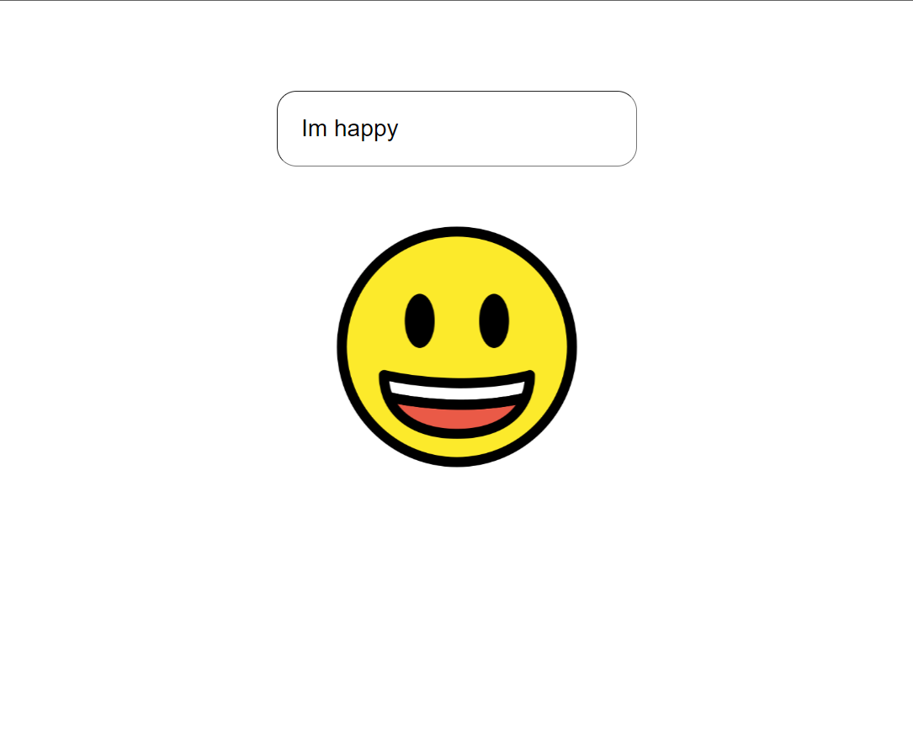
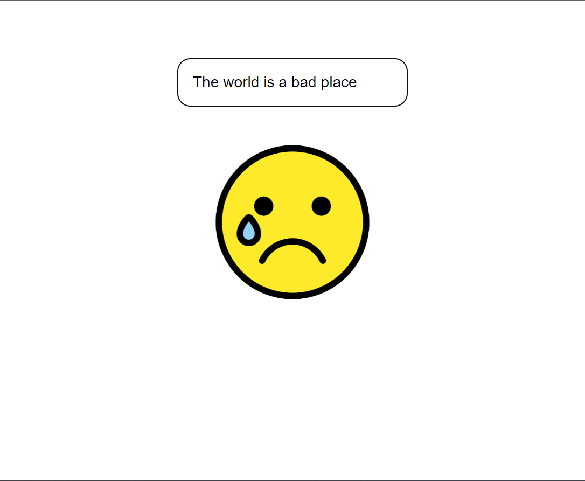

# Demo Sentiment

## Description
Sentiment is a mini project that utilizes the Natural Language Toolkit (NLTK) library for sentiment analysis. It all started when I had a Python task at hand and a friend recommended using NLTK for text analysis. As I delved deeper into NLTK, I discovered the exciting possibility of sentiment analysis.

The goal of Sentiment is to create a fun project where an emoji reacts to the sentences entered in an input field. It's a playful way to showcase the power of sentiment analysis and add some interactivity to the user experience.

## Getting started

To get started quickly, you can use the provided run.bat file. Simply activate it, and it will handle the installation and execution of the required dependencies (Node.js and Python) on your system. Make sure you have Node.js and Python installed beforehand. If you encounter any issues, you can visit the running Vite React app [here](https://vitejs.dev/guide/) and find instructions for installing Python [here](https://www.python.org/).

Feel free to explore Sentiment, enter various sentences, and observe how the emoji reacts based on the sentiment analysis results. Have fun analyzing the sentiment of your texts!

## Technologies Used
Front:
- React (JavaScript framework)
- Styled components
- Node.js (JavaScript runtime)

Back: 
- Python
- Flask
- Flask cors
- NLTK (Natural Language Toolkit)

## Examples of using Sentiment

## Acknowledgements
Special thanks to my friend who introduced me to NLTK and inspired me to create this sentiment analysis project.

## P.S
This project is still in development stage, it is something I really enjoyed doing after so much time of loosing interest to programing, so if you have any suggestions I will be happy to implement them.